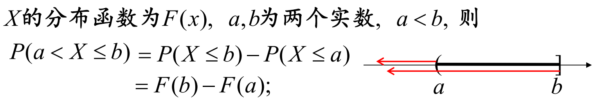

- Book
	- 林华达推荐
	- 概率
		- **Applied Multivariate Statistical Analysis (5th Ed.)  by Richard A. Johnson and Dean W. Wichern**
		- **Introduction to Graphical Models (draft version).  by M. Jordan and C. Bishop.**
	- 分析
		- **Principles of Mathematical Analysis, by Walter Rudin**
		- **Introductory Functional Analysis with Applications, by Erwin Kreyszig.**
	- 拓扑
		- **Topology (2nd Ed.)  by James Munkres**
		- **Lie Groups, Lie Algebras, and Representations: An Elementary Introduction.  by Brian C. Hall**
- 学科
	- Discrete Mathematics
	  collapsed:: true
		- 课件
			- 厦门大学
				- [离散数学 - Yang Lu](https://jasonyanglu.github.io/teaching/%E7%A6%BB%E6%95%A3%E6%95%B0%E5%AD%A6_2022)
		- 命题逻辑
			- 联结词：$$ \neg \vee \wedge  $$
			- 等值演算
				- |序号| 名称 | 公式 |
				  |--|:--|--:|
				  | 1 | 双重否定 | $$ A  \Leftrightarrow \neg\neg A$$ |
				  | 2 |等幂律 | $$ A \Leftrightarrow A \vee A $$   $$ A \Leftrightarrow A \wedge A $$ |
				  | 3 |交换律 | $$ A \vee B \Leftrightarrow B \vee A $$   $$ A \wedge B \Leftrightarrow B \wedge A$$ |
				  | 4 |结合律 | $$ (A \vee B) \vee C \Leftrightarrow A \vee (B \vee C) $$ $$  (A \wedge B) \wedge C \Leftrightarrow A \wedge (B \wedge C) $$ |
				  | 5 |分配律 | $$ A \vee (B \wedge C) \Leftrightarrow (A \vee B) \wedge (A \vee C) $$   $$ A \wedge (B \vee C) \Leftrightarrow (A \wedge B) \vee (A \wedge C)$$ |
				  | 6 |德-摩根律 | $$ \neg (A \vee B) \Leftrightarrow \neg A \wedge \neg B $$   $$ \neg (A \wedge B) \Leftrightarrow \neg A \vee \neg B $$ |
				  | 7 |吸收率 | $$ A \vee (A \wedge B) \Leftrightarrow A $$   $$ A \wedge (A \vee B) \Leftrightarrow A $$ |
				  | 8 |零律 | $$ A \vee 1 \Leftrightarrow 1 $$   $$  A \wedge 0 \Leftrightarrow 0 $$ |
				  | 9 |同一律 | $$ A \vee 0 \Leftrightarrow A $$   $$  A \wedge 1 \Leftrightarrow A $$ |
				  | 10 |排中律 | $$ A \vee \neg A \Leftrightarrow 1 $$ |
				  | 11 |矛盾律 | $$ A \wedge \neg A \Leftrightarrow 0 $$ |
				  | 12 |蕴含等值律 | $$ A \to B \Leftrightarrow \neg A \vee B $$ |
				  | 13 |等价等值律 | $$ A \leftrightarrow B \Leftrightarrow (A \rightarrow B) \wedge (B \rightarrow A) $$ |
				  | 14 |假言易位 | $$ A \to B \Leftrightarrow \neg B \to \neg A $$ |
				  | 15 |等价否定等值律 | $$ A \leftrightarrow B \Leftrightarrow \neg A \leftrightarrow \neg B $$ |
				  | 16 |归谬论 | $$ (A \to B) \wedge (A \to \neg B) \Leftrightarrow \neg A $$ |
			- PC(Proposition calc)
			  collapsed:: true
				- Proposition
				  collapsed:: true
					- 化简规则  $$p \wedge q \Rightarrow p , p \wedge q \Rightarrow q $$
					- 附加规则  $$ p \Rightarrow p \vee q, q \Rightarrow p \vee q$$
					- 假言推理  $$ p, p \rightarrow q \Rightarrow q$$
					- 拒取式  $$ p \rightarrow q, \neg q \Rightarrow \neg p$$
					- 析取三段论  $$  p \vee q, \neg p \Rightarrow q $$
					- 合取式  $$ p, q \Rightarrow p \vee q $$
					- 假言三段论 $$ p \rightarrow q, q \rightarrow r \Rightarrow p \rightarrow r $$
					- 等价三段论 $$ p\leftrightarrow q, q \leftrightarrow r \Rightarrow p \leftrightarrow r $$
					- 构造性二难 $$ p \rightarrow q, r \rightarrow s, p \vee r \Rightarrow q \vee s $$
					- 归结式 $$ p \vee q, \neg p \vee s \Rightarrow q \vee s $$
					-
					-
				- Axious
					- A1: $$A \to (B \to A)$$
					- A2: $$(A\to (B \to C)) \to ((A \to B) \to (A \to C))$$
					- A3: $$( \neg A \to \neg B) \to (B \to A)$$
					- A4: $$\forall xA(x) \to A(t/x)$$
					- A5: $$ \forall x (A(x) \to B(x)) \to (\forall xA(x) \to \forall x B(x))$$ (x为任一自由变元)
					- A6: $$A \to \forall x A $$(A中无自由变元x)
					- A7: （A1到A6的全称封闭式都是FC的公理）
				- 谓词演算的推理规则
					- U: Universal, E: Existential, I: Instantiation, G: Generalization
						- 1. UI(全称量词消去) $$\forall x A(x) \Rightarrow A(x) $$ 
						  3. EI(存在量词消去) $$ \exist x A(x) \Rightarrow A(c) $$ 
						  4. UG(全称量词引入) $$  A(y) \Rightarrow \forall x A(x) $$
						  5. EG(存在量词引入) $$ A(c) \Rightarrow \exist x A(x) $$
		- 集合论
			- 基本运算
				- 并 $$ A \cup B = \{x \mid x \in A \vee x \in B\} $$
				- 交 $$ A \cap B = \{ x\mid x \in A \wedge x \in B \} $$
				- 差 $$ A - B = \{ x\mid x \in A \wedge x \notin B \}$$
				- 对称差 $$ A \oplus B = \{ x\mid (x \in A \wedge x \notin B) \vee (x \in B \wedge x \notin A)\}$$
				- P(A): A 的幂集  $$ P(A) = \{ x\mid x \subseteq A \} $$
			- 等式
				- | 序号 | 名称 | 等式 |
				  |--|:--|--:|
				  | 1 | 恒等 | $$ A \cup \phi = A, A \cap E = A $$ |
				  | 2 | 支配 | $$ A \cup E = E, A \cap \phi= \phi $$ |
				  | 3 | 幂等 | $$ A \cup A = A, A \cap A = A $$ |
				  | 4 | 双否 | $$ \sim (\sim A) = A $$ |
				  | 5 | 交换 | $$ A \cup B = B \cup A, A \cap B = B \cap A $$ |
				  | 6 | 结合 | $$ A \cup (B \cup C) = (A \cup B) \cup C, A \cap (B \cap C) = (A \cap B) \cap C $$ |
				  | 7 | 分配 | $$ A \cap (B \cup C) = (A \cap B)  \cup (A \cap C), A \cup (B \cap C) = (A \cup B)  \cap (A \cup C) $$ |
				  | 8 | 摩根 | $$ \sim(A \cup B) = \sim A \cap \sim B, \sim (A \cap B) = \sim A \cup \sim B $$ |
				  | 9 | 吸引 | $$ A \cup (A \cap B) = A, A \cap (A \cup B) = A $$ |
				  | 10 | 补律 | $$ A \cap \sim A = \phi, A \cup \sim A = E $$ |
			- 二元关系
				- 有序对
					- 定义：由两个元素$$x, y (允许x = y)$$ 按一定顺序排列成的二元组叫做一个
					  有序对, 记作 $$ \langle x, y \rangle $$ , 其中$$x$$是它的第一元素, $$y$$是它的第二元素
					- 性质：
						- $$ if  x \ne y，then \langle x, y \rangle \ne \langle y, x \rangle $$
						- $$ \langle x, y \rangle = \langle u, v \rangle \Leftrightarrow (x=u) \wedge (y = v)$$
					- 有序对中元素**有序**，集合中元素**无序**
				- 笛卡尔积
					- $$ A \times B = \{\langle  x, y \rangle |  x \in A \wedge y \in B\} $$
					- 性质：
						- $$ A\times B = \phi \Leftrightarrow (A = \phi) \vee (B = \phi) $$
						- $$ A \times B \ne B \times A (除非A = ∅或B = ∅或A = B)$$
						- $$ (A \times B) \times C \ne A \times (B \times C) (除非A = ∅或B = ∅或A = B) $$
						- 笛卡尔积对集合运算∗满足分配律,
						  ∗代表∪, ∩, −, ⊕运算
						- 设A, B, C, D为4个集合, 则有
						  $$A ⊆ C ∧ B ⊆ D ⇒ A×B ⊆ C×D$$
				- 二元关系
					- 定义：如果一个集合满足以下条件之一
						- 1. 集合非空，且它的元素都是有序对
						  2. 集合是空集
						- 则称该集合为一个**二元关系**， 记作$$R$$. 如果$$ \langle x, y\rangle \in R $$, 记为$$ xRy $$. 如果$$ \langle x, y\rangle \notin R $$, 记为$$ x\rlap{|}Ry $$
					- 定义：设A, B为集合, A×B的任何子集所定义的二元关系叫作从A到
					  B的二元关系, 特别当A = B时则叫作A上的二元关系
					- 定义：
						- 空关系：∅
						- 全域关关系：$$ E_{A} = \{\langle x, y \rangle | x, y \in A\}  = A \times A$$
						- 恒等关系：$$ I_{A} = \{\langle x, x \rangle | x \in A\}  $$
				- 关系的运算
					- 关系R的定义域dom R, 值域ran R和域fld R是
					  $$dom R = \{x|∃y(xRy)\} $$
					  $$ran R = \{y|∃x(xRy)\}$$
					  $$fld R = dom R ∪ ran R$$
					- 设R为二元关系,R的逆关系,简称R的逆, 记作$$ R^{-1} $$
						- $$ R^{-1} = \{\langle x,y \rangle | yRx\} $$
					- 设F, G为二元关系, G对F的右复合记为F ◦ G(读作F圈G)
						- $$ F\circ G = \{\langle x, y \rangle | \exist t(xFt \wedge tGy)\} $$
					- 逆关系的分配律
						- $$(R \cup S)^{-1} = R^{-1} \cup S^{-1}$$
						- $$(R \cap S)^{-1} = R^{-1} \cap S^{-1}$$
					- 设F,G,H是任意关系，则有
						- $$ (F^{-1})^{-1} = F $$
						- $$ dom F^{-1} = ran F, ran F^{-1} = dom F $$
						- $$ (F \circ G) \circ H = F \circ (G \circ H) $$
						- $$ (F \circ G)^{-1} = G^{-1} \circ F^{-1} $$
						- $$ (\sim R)^{-1} = \sim (R^{-1}) $$
					- 设R为A上的关系, 则
						- $$ R \circ I_{A} = I_{A} \circ R = R $$
					- 设R为A上的关系, n为自然数, 则R的n次幂是
						- 1. $$ R^{0} = \{ \langle x, x \rangle | x \in A \} = I_{A} $$
						  2. $$ R^{n + 1} = R^{n} \circ R, n \ge 0  $$
					- 关系矩阵
						- $$ M_{R^{-1}} = M_{R}^{T} $$
						- $$ M_{R_{1} \circ R_{2}} =  M_{R_{1}} M_{R_{2}}$$
	- 概率论与数理统计
		- 事件的运算及关系
			- A与B的差事件
				- $$ A - B = A \overline B = A \cup B - B = A - AB$$
		- P
			- 统计定义：当随机试验的次数增加时，随机事件A发生的频率f(x)趋近的稳定值p称为概率，记为P(x) = p
			- 公理化定义：设随机试验对应的样本空间为S. 对每个事件A， 定义P(A), 满足：
				- 1. 非负性： $$ P(A) \ge 0 $$
				- 2. 规范性： $$ P(S) = 1$$
				- 3. 可列可加性： $$ A_{1}, A_{2}... 两两互斥，即A_{1}A_{2} = \phi, i \ne j, 则 P(\bigcup_{i=1}^{\infty}A_{i}) = \sum_{i=1}^{\infty}P(A_{i}) $$
			- 性质：
				- 1. $$ P(\phi) = 0 $$
				- 2. $$ P(A) = 1 - P(\overline{A}) $$
				- 3. $$ A_{1}A_{2} = \phi, i \ne j, 则 P(\bigcup_{i=1}^{n}A_{i}) = \sum_{i=1}^{n}P(A_{i}) (有限可加性)$$
				- 4. $$  若 A \sub B, 则 P(B - A) = P(B) - P(A). 一般情况下，P(B - A) = P(B) - P(AB) $$
				- 5. 加法公式：$$ P(A \cup B) = P(A) + P(B) - P(AB) $$
					- 5.1 $$ P(A \cup B \cup C) = P(A) + P(B) + P(C) - P(AB) - P(AC) - P(BC) + P(ABC) $$
					- 5.2 $$ 一般情况，略 $$
		- 古典概型
			- 不放回抽样：
				- 有N个球，其中a个白球，b = N - a个黄球，采用不放回抽样取n个球(n <= N), 记 $$ A_{k} = \{恰好取到k个白球\} (k \le a), 则 $$
					- $$ P(A_{k}) = \frac{C_{a}^{k}C_{b}^{n - k}}{C_{N}^{n}} ,  其中 C_{N}^{n} = \binom {N}{n} = \frac{N!}{n!(N-n)!} $$
		- 条件概率
			- 
			- 定义：
				- $$ P(B|A) = \frac{P(AB)}{P(A)}, P(A) \ne 0 $$
			- 性质：$$ P(\bullet |A) $$是概率
				- 非负性：$$ P(B|A) \ge 0 $$
				- 规范性：$$ P(S|A) = 1 $$
				- 可列可加性：$$ B_{1}, B_{2} ... B_{i}B_{j} = \phi, i \ne j, 则 P(\bigcup_{i=1}^{\infty}B_{i} | A) = \sum_{i=1}^{\infty}P(B_{i} | A) $$
			- 条件概率$$ P(\bullet |A) $$具有概率的所有性质
				- $$ P(B|A) = 1 - P(\overline B | A) $$
				- $$ P(B \cup C | A) = P(B|A) + P(C|A) - P(BC|A) $$
				- $$ B \supset C  \Rightarrow P(B|A) \ge P(C|A)$$
			- 乘法公式
				- $$ P(AB) = P(A)·P(B|A) = P(B)·P(A|B) $$
				- $$P(ABC) = P(A)·P(B|A)·P(C|AB) $$
		- 全概率公式与贝叶斯公式
			- 定义：$$称 B_{1}, B_{2}, ..., B_{n}为S的一个划分， 若$$
				- 1. 不漏 $$ B_{1} \cup B_{2} ··· \cup B_{n} = S$$
				- 2. 不重 $$ B_{i}B_{i} = \phi, i \ne j $$
			- 全概率公式：$$ P(A) = \sum_{j=1}^{n}P(B_{j})·P(A|B_{j}) $$
				- 设 $$ P(B_{j}) = p_{j}, P(A|B_{j}) = q_{j}, j = 1, 2, ..., n, 则 P(A) = \sum_{j=1}^{n} p_{j}q_{j} $$
			- Bayes公式：$$ P(B_{i} | A) = \frac{p_{i}q_{i}}{\sum_{j=1}^{n}p_{j}q_{j}} = \frac{P(B_{i})P(A|B_{i})}{\sum_{j=1}^{n}P(B_{j})P(A|B_{j})}$$
		- 事件的独立性
			- 定义：设A, B是两随机事件，如果 $$ P(AB) = P(A)P(B) $$, 则称A, B相互独立
			- 若$$ P(A) > 0, P(B) > 0, 则 P(AB) = P(A)P(B) \Leftrightarrow P(B|A) = P(B) \Leftrightarrow P(A|B) = P(A) $$
			- 如下等价
				- $$A, B相互独立 \Leftrightarrow \overline A, B相互独立 \Leftrightarrow A, \overline B相互独立 \Leftrightarrow \overline A, \overline B 相互独立$$
		- 随机变量
			- 定义：设随机试验的样本空间为S， 若$$ X = X(e) $$ 为定义在S上的实值单值函数，则称$$X(e)$$为随机变量, 简写为$$X$$
			- 随机事件可以表示为 $$ A = \{ e: X(e) \in I \} = \{ X \in I \}, I \sub R $$
			- 
			- 离散型
				- 定义：若随机变量X的取值为有限个或可数个，则称X为离散型随机变量
				- 概率分布律
					- 内容：$$  $$
						- \begin{cases}随机变量的所有可能取值
						   \\取每个可能取值相应的概率
						  \end{cases}
					- 性质： $$ p_{k} \ge 0, \sum_{k=1}^{+\infty} p_{k} = 1 $$
					- 另一表示形式：$$ P(X = x_{k}) = p_{k}, k =  1, 2, ... $$
				- 0-1分布
					- 定义：随机变量只能取0(概率为1 - p)，1(概率为p)两个值；其中 $$ 0 < p < 1 $$, 就称X服从参数为p的0-1分布（或两点分布），记为$$ X \sim 0 - 1(p) 或 X  \sim B(1, p) $$
					- 设试验$$E$$只有两个可能的结果：$$A或\overline A, 且 P(A) = p, 0<p<1. $$将$$E$$独立地重复地进行$$n$$次，称这一串重复的独立试验为$$n$$重贝努利试验
				- 二项分布
					- 定义：若$$ X $$的概率分布律为 $$ P(X = k) = C_{n}^{k} p^{k}(1-p)^{n-k}, k = 0, 1,...,n, $$其中 $$ n \ge 1, 0 < p < 1 $$, 就称$$X$$服从参数为$$n, p$$的二项分布（Binomial）, 记为 $$ X \sim B(n, p) $$
					- 可以证明：$$  1 = (p+q)^{n} = \sum_{k=0}^{n}C_{n}^{k}p^{k}q^{n-k}, 其中q = 1- p $$
				- 泊松分布
					- 定义：若$$X$$的概率分布律为 $$ P(X = k) = \frac{\lambda^{k}e^{-\lambda}}{k!}, k = 0, 1, 2, ... , $$其中 $$ \lambda > 0 $$, 就称$$ X $$服从参数为 $$ \lambda $$的泊松分布（Poisson）, 记为 $$ X \sim \pi(\lambda) $$ 或 $$ X \sim P(\lambda) $$
						- 根据泰勒展开式可得：$$ e^{\lambda} = \sum_{k=0}^{+ \infty } \frac{\lambda^{k}}{k!}$$
					- 用途
						- 某人一天收到的微信数量
						- 来到某公交车站的乘客数量
					- 如果某事件以固定强度$$ \lambda $$, 随机且独立地出现，该事件在单位时间内出现的次数(个数)可以看成是服从泊松分布
					- 二项分布与泊松分布有如下近似公式
						- 当 $$ n > 10, p < 0.1时， C_{n}^{k}p^{k}(1-p)^{n-k} \approx \frac{\lambda^{k}e^{-\lambda}}{k!}, 其中 \lambda = np$$
				- 几何分布
					- 定义：若$$X$$的概率分布律为 $$ P(X = k) = p(1 - p)^{k-1}, k = 1,2,3,..., 其中 0< p < 1 $$, 称$$ X $$服从参数为$$ p $$的几何分布(Geometric), 记为 $$ X \sim Gemo(p) $$
					- 用途：在重复多次和贝努利试验里，试验进行到某种结果出现第一次为止，此时的试验总数服从几何分布
				- 分布函数$$ F(x) $$
					- 定义：随机变量$$X$$, 对任意实数$$x$$, 称函数 $$ F(x) = P(X \le x) $$为$$ X $$的概率分布函数，简称分布函数
					- 性质:
						- $$ 0 \le F(x) \le 1 $$
						- $$ F(x)单调不减 $$
						- $$ F(-\infty) = 0, F(+\infty) = 1 $$
						- $$ F(x)是右连续函数，即F(x + 0) = F(x) $$
					- 任何随机变量都有相应的分布函数
					- 几何意义
					- 
					- 用途：可以给出随机变量落入任意一个范围的可能性
					- 
			- 连续型
				- 定义：对于随机变量$$X$$的分布函数 $$ F(x) $$, 若存在非负的函数$$ f(x) $$, 使对于任意实数 $$ x $$有： $$F(x) = \int_{-\infty}^{x}f(t)\delta t $$，则称$$ X $$为连续型随机变量，其中$$ f(x)$$称为$$X$$的概率密度函数，简称概率密度
				- 性质：
					- $$ f(x) \ge 0 $$
					- $$  \int_{-\infty}^{+\infty}f(x)\delta x = 1$$
					- 对于任意实数$$x_{1}, x_{2}(x_{1} < x_{2}), P(x_{1} < X \le x_{2}) = \int_{x_{1}}^{x_{2}}f(t)\delta t$$
					- 在$$ f(x) $$连续点$$x$$, $$ {F}'(x) = f(x), P(x < X \le x + \Delta x) \approx f(x)·\Delta x $$; 这表示$$ X $$落在点 $$x$$附近$$(x, x + \Delta x]$$的概率近似等于$$f(x)\Delta x$$
				- 均匀分布
					- 定义：若$$ X $$的概率密度函数为 $$ f(x) =  $$
				-
	- 高等数学
	  collapsed:: true
		- Definite Integrals
			- 公式：$$ \int_{a}^{b}2x\mathrm{d}x $$
				- dx just means an** arbitrarily small change in x**
				- sum: $$ \int_{}{} $$
				- differential: $$ \mathrm{d}$$
				- 
- Any Note
	- Geometric Sequences and Sums
	  collapsed:: true
		- 定义：$$ \{a, ar, ar^{2}, ar^{3}, ...\} $$
			- **a** is the first term
			- **r** is the factor between the terms(called the "common ratio"), and **r** should not be **0**
		- term: $$ x_{n} = ar^{n-1} (x_{1} = ar^{0})$$
		- Summing: $$a + ar + ar^{2} + ... + ar^{n-1}$$
		- $$ \sum_{k=0}^{n-1}(ar^{k}) = a\begin{pmatrix}\frac{1-r^n}{1-r} \end{pmatrix} $$
		- Infinite Geometric Series
			- $$ \sum_{k=0}^{\infty}(ar^{k}) = a\begin{pmatrix}\frac{1}{1-r} \end{pmatrix} $$
				- $$ -1< r < 1, r  \ne 0 $$
	- Geometric Mean
		- or **n** numbers: multiply them all together and then take the **n**th root
		- $$ \sqrt[n]{a_{1}\times a_{2} ... \times a_{n}} $$
	- 
	- Gamma function
		- $$ \Gamma(s) = \int_{0}^{\infty}e^{-t}t^{s-1}\mathrm{d}t $$
	- 
	- 图的欧拉公式
		-
	- 自考题型
		- 15选择
		- 10问答
			- 真值表判定可满足式
			- 等值演算求主合取范式
			- 求关系矩阵和闭包，求r(R), s(R), t(R)
				- 自反r(R): $$ R \cup I_{A} $$
				- 对称s(R): $$ R \cup R^{-1} $$
				- 传递t(R): $$ R \cup R^{2} \cup R^{3} $$
			- Kruskal算法，画最小生成树，详细过程，计算权
			- 已知有向图，求邻接矩阵，计算通路、回路
			- 使用二叉树表示算术表达式，给出前序、中序、后序遍历序列
			- 已知集合和运算，画哈斯图，求极大、极小、最大、最小元，判断是否为格
			- 证明构成交换群
			- 命题符号化，并证明推理
			- 无向简单图，证明同构，证明n度顶点个数
		- 10填空