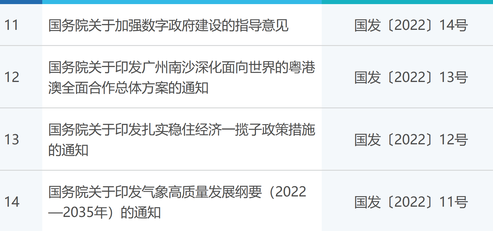
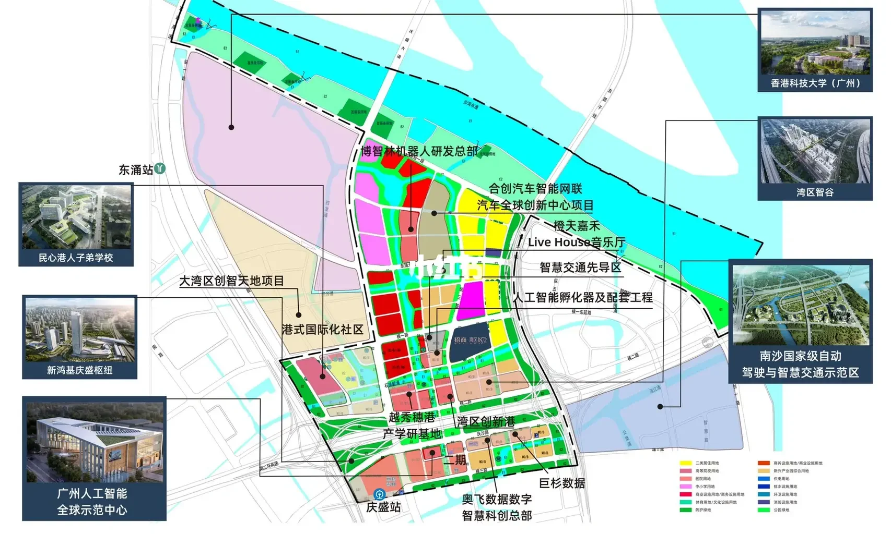
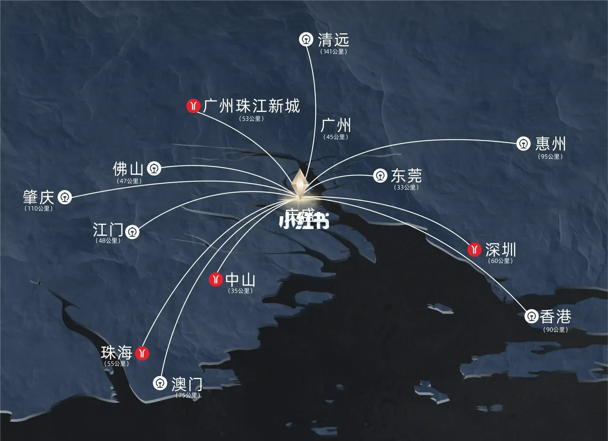
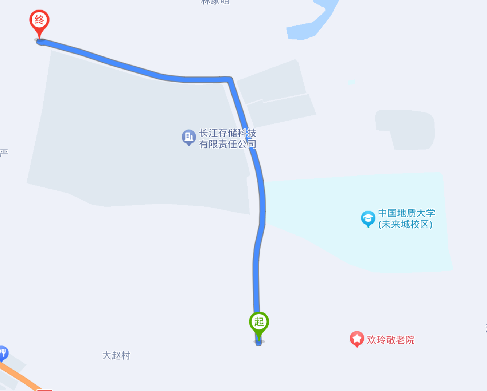

- 出国
	- 加拿大
		- https://zhuanlan.zhihu.com/p/606406291
		- https://www.noahpinion.blog/p/maximum-canada-is-happening
	- 澳大利亚、新西兰
	- 日本
	- 泰国
		- {{video https://www.youtube.com/watch?v=gckueCMYtZY}}
	- 马来/新加坡
		- {{video https://www.youtube.com/watch?v=PcShMCkpSYQ}}
- 国内
	- 大湾区
		- [陳鳳馨分享從粵港澳大灣區參訪：重新思考公共政策及產業政策【Yahoo TV#風向龍鳳配】 - YouTube](https://www.youtube.com/watch?v=n_LfTiIlxcM)
		- 南沙
			- [国务院关于印发广州南沙深化面向世界的粤港澳全面合作总体方案的通知](http://www.gov.cn/zhengce/content/2022-06/14/content_5695623.htm)
			- [国令、国发、国函、国发电、国办发、国办函、国办发电的全称分别是什么？有什么区别？ - 知乎 (zhihu.com)](https://zhuanlan.zhihu.com/p/403328311)
			- 
			- [庆盛枢纽区块：科创资源“汇流”-广州市南沙区人民政府门户网站 (gzns.gov.cn)](http://www.gzns.gov.cn/zwgk/rdzt/gzlfzcnk/fyzxlqxzjyg/content/post_8936103.html)
			- {:height 416, :width 679}
			- 
			  collapsed:: true
				-
	- 上海城市群
	  collapsed:: true
		-
	- 武汉
		- 
- $$ P_{\theta }(y=0) = 1-\theta $$
- P_{\theta }(y=0) = 1-\theta