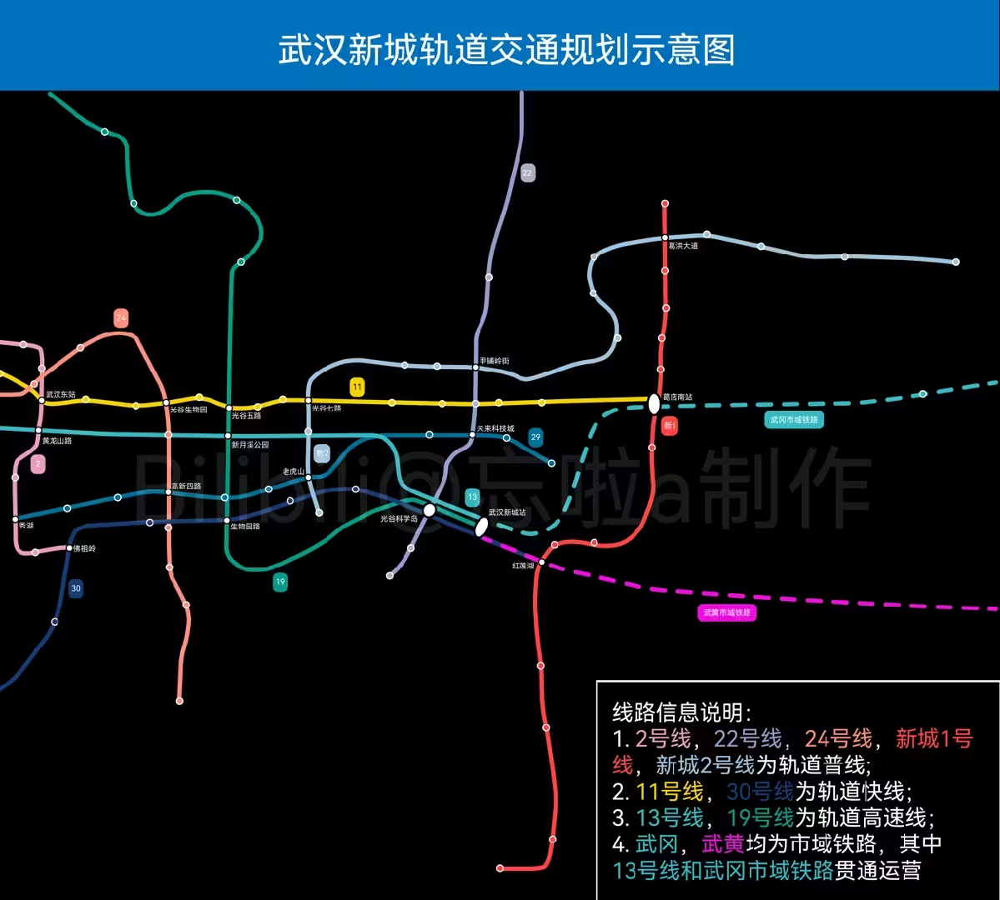
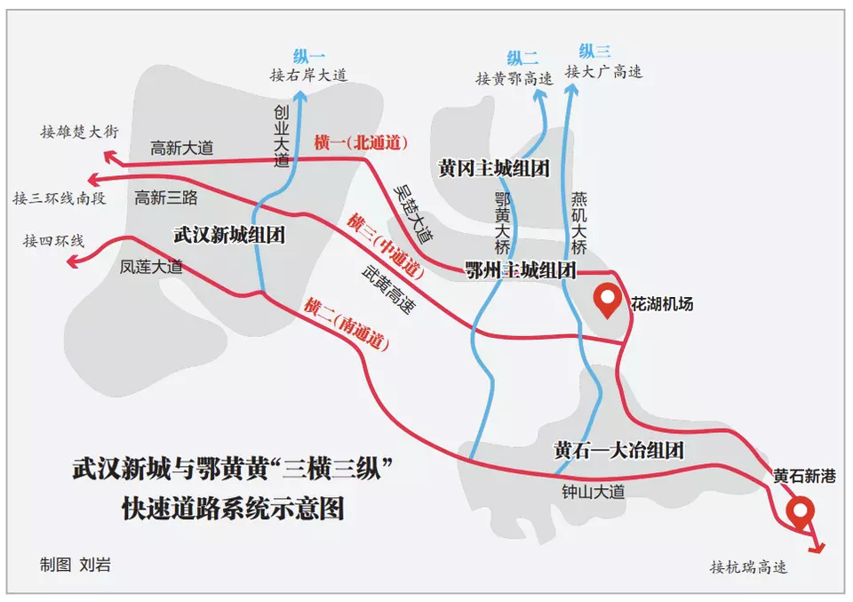

- 出国
	- 加拿大
		- https://zhuanlan.zhihu.com/p/606406291
		- https://www.noahpinion.blog/p/maximum-canada-is-happening
	- 澳大利亚、新西兰
		- 新西兰
			- {{video https://www.youtube.com/watch?v=FYez_UcIe88}}
	- 日本
<<<<<<< HEAD
	- 泰国
		- {{video https://www.youtube.com/watch?v=gckueCMYtZY}}
	- 马来/新加坡
		- {{video https://www.youtube.com/watch?v=PcShMCkpSYQ}}
=======
	- 英国
		- [英国旅行贵？东西难吃？英伦深度游，颠覆你认知！ - YouTube](https://www.youtube.com/watch?v=oxxSv8OUzWg)
>>>>>>> 5963a81 ([logseq-plugin-git:commit] 2023-06-25T15:18:50.037Z)
- 国内
	- 大湾区
		- [中共中央 国务院印发《粤港澳大湾区发展规划纲要》 (mofcom.gov.cn)](http://www.mofcom.gov.cn/article/b/g/201904/20190402851396.shtml)
		- [陳鳳馨分享從粵港澳大灣區參訪：重新思考公共政策及產業政策【Yahoo TV#風向龍鳳配】 - YouTube](https://www.youtube.com/watch?v=n_LfTiIlxcM)
		- 南沙
			- 概览
				- 三个启动区
					- 庆盛
					- 南沙湾
					- 南沙枢纽
				-
			- [国务院关于印发广州南沙深化面向世界的粤港澳全面合作总体方案的通知](http://www.gov.cn/zhengce/content/2022-06/14/content_5695623.htm)
			- [国令、国发、国函、国发电、国办发、国办函、国办发电的全称分别是什么？有什么区别？ - 知乎 (zhihu.com)](https://zhuanlan.zhihu.com/p/403328311)
			- 
			- [庆盛枢纽区块：科创资源“汇流”-广州市南沙区人民政府门户网站 (gzns.gov.cn)](http://www.gzns.gov.cn/zwgk/rdzt/gzlfzcnk/fyzxlqxzjyg/content/post_8936103.html)
			- [6648元/平！刚刚，越秀地产超22亿拿下广州南沙一宅地！_新浪财经_新浪网 (sina.com.cn)](https://finance.sina.com.cn/stock/relnews/hk/2023-05-15/doc-imytwaay7145336.shtml)
			- {:height 357, :width 480}
			- {:height 416, :width 679}
			- 
			  collapsed:: true
				-
	- 上海城市群
	  collapsed:: true
		-
	- 武汉
		- 
		-
		- 
		- 
- $$ P_{\theta }(y=0) = 1-\theta $$
- P_{\theta }(y=0) = 1-\theta