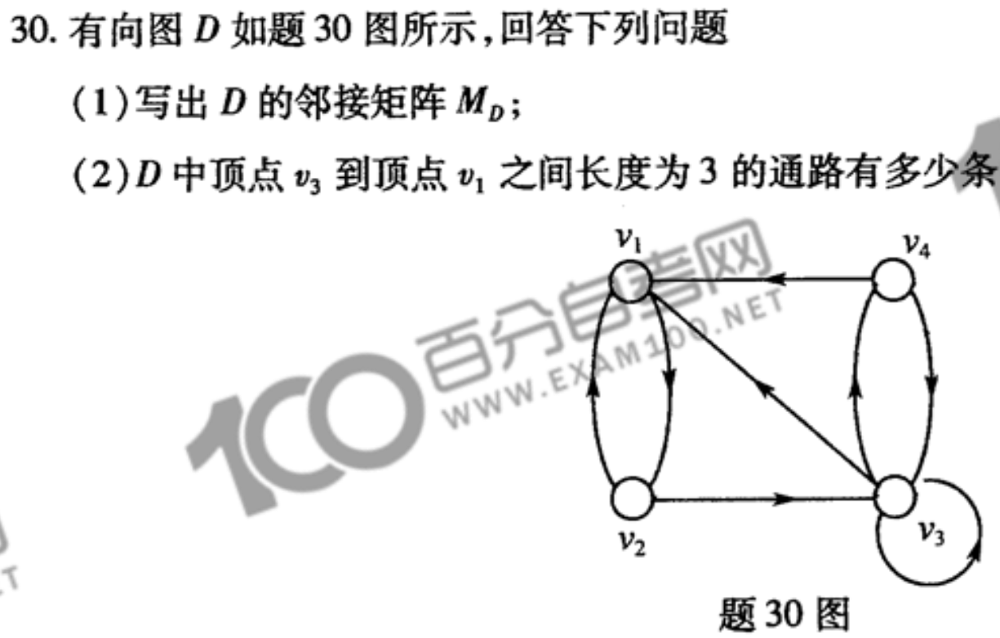
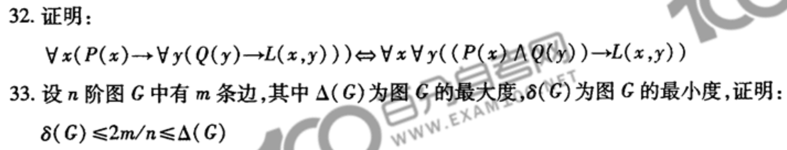
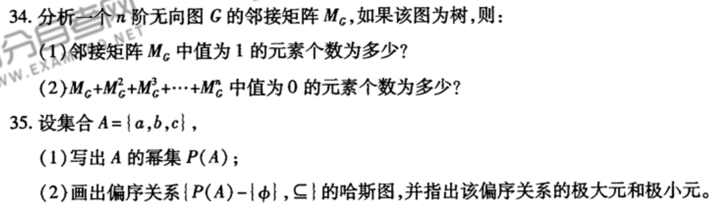
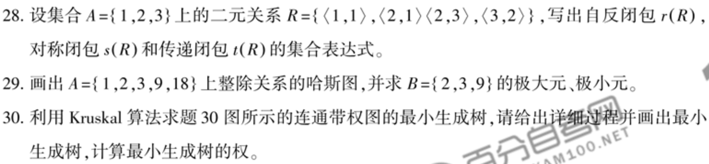
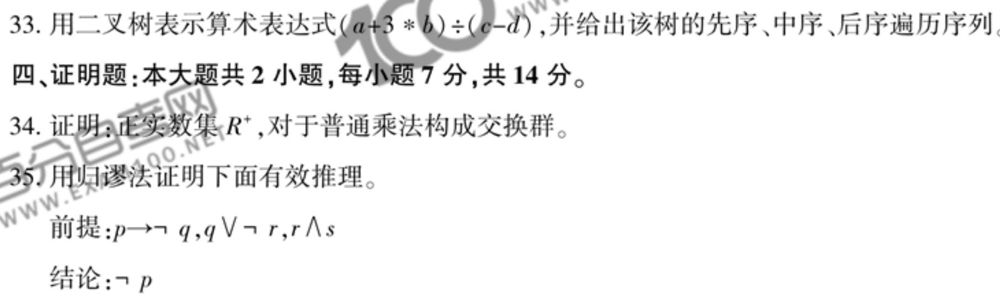
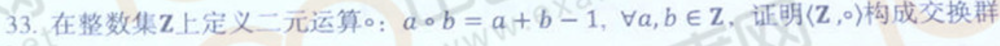

- 离散数学
  collapsed:: true
	- TODO:
		- 真值表求$$ (P \rightarrow Q) \wedge (R \rightarrow Q) \Leftrightarrow P \vee R \rightarrow Q $$
		- 等值演算求 $$ (P \rightarrow \neg Q) \rightarrow R $$ 主析取范式
		- 填表判断： 可结合、可交换；自反、对称、传递
		- 
		- 对于任意集合A和B，证明： $$ P(A) \cap P(B) = P(A \cap B), 其中P(A)表示A的幂集 $$
		- 
		- 
		- 
		- 
		- 
	- 小项、大项
		- 任意两个不同小项的合取，必真or必假
		- 主析取欧式k个小项，主合取范式?个大项
	- TODO 谓词辖域变更
	- 等值演算求主析取范式
	- 集合
		- A = {1, 2}, 求$$ A^{2} $$
		- |A| = 4, |B| = 2, A到B满射函数数量
	- 关系
		- 关系运算
			- 已知$$R$$,求$$R^{2}$$
		- 集合|A| = n, 求最大等价关系个数
			- [(16条消息) 【集合论】等价关系个数计算问题 ( 有序对个数计算 | 二元关系个数计算 | 划分 | 等价关系 )_等价关系的个数怎么求_韩曙亮的博客-CSDN博客](https://blog.csdn.net/shulianghan/article/details/96347307)
				- 等价关系数 = 集合划分数
				- *S*(N,m)=*C*(N,m)
				- *S*(4,1)+*S*(4,2)+*S*(4,3)+*S*(4,4)=1+7+6+1=15
		- TODO 关系矩阵，性质；判断
			- 对称：对称矩阵
			- 自反：
			- 传递
		- 求群的单位元，零元
	- 图
		- TODO V, E, D关系
		- TODO n阶无向简单图，结点最大度数
			- n - 1
		- TODO 完全图，生成树
			- 需删除的边数
		- 简单图
		- n阶数，求分支结点数最大多少，求最多树叶数
		-
	- 自测
		- 2022.10
			- 选择
				- 1. C 
				  2. C
				  3. A
				  4. B
				  5. C
				  6. D
				  7. A TODO
				  8. - TODO: 构成无向树条件
				  9. C
				  10. D
				  11. A
				  12. C TODO:n阶树 => 完全图， 完全图 => n阶树公式
				  13. B TODO: why, 判断步骤
				  14. A
				  15. C TODO: 判断步骤
			- 填空
				- 16. 2， 非单，非满
				  17. {<1, 2>, <2, 4>, <3, 3>, <1, 3>, <4, 2>}, {1, 2, 3, 4}
				  18. {<2, 1>, <3, 2>, <3, 1>, <4, 3>}
				  19. 16
				  20. T, F
				  21. 5 TODO:至少
				  22. TODO:完全二叉数
				  23. TODO
				  24. TODO：n阶树，邻接矩阵非0个数
				  25. 2^n - 1
			- 计算
				- 26.
			- 证明
				- 31.
			- 应用
				- 34. 
				  35.
		- 2022.4
			- 选择
				- 1. C
				  2. A
				  3. C
				  4. B
				  5. D TODO: 求对称、反对称同时存在情况
				  6. B TODO: V, E, D关系
				  7. B
				  8. TODO: 构成无向图条件
				  9. A
				  10. C TODO: 关系矩阵深化
				  11. B
				  12. C
				  13. B
				  14. A
				  15. D
			- 填空
				- 16. TODO: A^2
				  17. {1, 2, 3, 4}, {2, 3, 4}
				  18. TODO: 关系的平方
				  19. TODO: 满射个数
				  20. F, T
				  21. 7, 4
				  22. 5, 3 TODO: 分支节点定义
				  23. A, 空
				  24. 15 TODO: 求连通图最大边数
				  25. n^2 - 1
			- 计算
				- 26. 1
			- 证明
				- 31.
			- 应用
				- 34.
		- 2021.10
			- 选择
				- 1. C
				  2. C
				  3. D TODO
				  4. A
				  5. C
				  6. A TODO: 满射个数
				  7. B
				  8. A TODO: 等价关系的运算
				  9. A
				  10. D TODO: 平面图的定义
				  11. B
				  12. C
				  13. C TODO: 补元的定义
				  14. C
				  15. C TODO: 分配格定义
			- 填空
				- 16. F
				  17. 略
				  18. 略
				  19. 略
				  20. 空，TODO: 划分、等价关系的定义
				  21. 空集，TODO
				  22. 空，TODO: 四元群
				  23. 10
				  24. 空， TODO: 同构树的棵数
				  25. 36
		- 2021.4
			- 选择
				- 1. B
				  2. D
				  3. A
				  4. A
				  5. D
				  6. A TODO: 简单图化
				  7. D
				  8. B
				  9. B
				  10. D TODO
				  11. D
				  12. D
				  13. A
				  14. A
				  15. A
			- 填空
				- 16. T
				  17. F
				  18. TODO: 独异点的定义
				  19. b^-1a^-1 TODO
				  20. 2 TODO
				  21. 12
				  22. 28
				  23. TODO: 对称差
				  24. TODO: 复合关系运算
				  25. TODO: 满射数量计算
		- 2020.10
			- 选择
				- 1. C
				  2. B
				  3. D
				  4. A
				  5. D
				  6. |A| = 4,  TODO: 求等价关系个数
				  7. B
				  8. C
				  9. D
				  10. D
				  11. B
				  12. A
				  13. A TODO: 关系运算
				  14. C
				  15. D
			- 填空
				- 16. TODO: 计算小项个数
				  17. 略
				  18. T
				  19. TODO: V, D, R关系
				  20. TODO: 关系复合
				  21. 略
				  22. 21
				  23. TODO: 求幺元步骤
				  24. 6
				  25. TODO: 双射
		- 2020.4
			- 选择
				- 1. D
				  2. B
				  3. D
				  4. A
				  5. B
				  6. C
				  7. B
				  8. D
				  9. A
				  10. D 错 C
				  11. B
				  12. A
				  13. A => D TODO
				  14. D TODO: => C 
				  15. D
			- 填空
				- 16. 3 TODO: 画真值表，数成假赋值个数
				  17. 空，TODO: 等价类
				  18. T
				  19. 11
				  20. TODO: 关系复合
				  21. 略
				  22. 11
				  23. 空
				  24. 8
				  25.
		- 2019.10
			- 选择
				- 1. 
				  2. 2
		- 2019.4
			- 1. 1
			  2. 2
		- 2018.10
			- 1. 2
			  2. 3
		- 2018.4
- 概率论